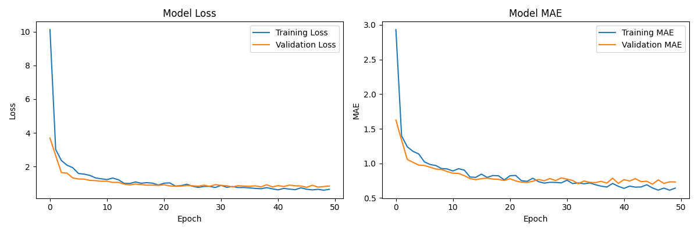
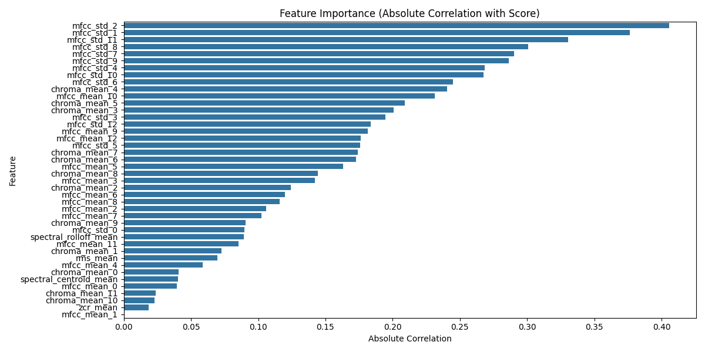

# Grammar Scoring Engine: Final Report

## Overview
This project develops a Grammar Scoring Engine for spoken English audio samples, predicting a continuous grammar score (0-5) for each file. The solution combines deep audio embeddings (Wav2Vec2) and handcrafted speech features, using a robust ensemble regression pipeline.

---

## 1. Data & Problem Statement
- **Input:** 45-60s spoken English audio files (train/test split)
- **Output:** Continuous grammar score (0-5)
- **Evaluation:** Pearson Correlation (Leaderboard), RMSE (for internal validation)

---

## 2. Preprocessing
- **Silence Removal:** `librosa.effects.trim` removes leading/trailing silence.
- **Noise Reduction:** Preemphasis filtering reduces background noise.
- **Amplitude Normalization:** Each audio is normalized to a fixed RMS value.
- All steps are applied identically to train and test audio.

---

## 3. Feature Extraction
- **Wav2Vec2 Embeddings:**
  - HuggingFace's `facebook/wav2vec2-base-960h` model.
  - Mean-pooled hidden states (768-dim) per audio file.
- **Handcrafted Features:**
  - MFCCs (mean, std), delta MFCCs, spectral contrast, chroma, pitch (mean, std), ZCR, RMS, speech rate, pause fraction.
- **Feature Fusion:** All features are concatenated into a single vector per file.

---

## 4. Feature Selection & Dimensionality Reduction
- **Constant Feature Removal:** `VarianceThreshold` drops zero-variance features.
- **PCA:** 128 principal components (fit on train fold only).
- **StandardScaler:** Standardizes features after PCA.

---

## 5. Model Pipeline & Ensembling
- **5-Fold Cross-Validation:** For robust validation and blending.
- **Models:**
  - LightGBM Regressor (regularized)
  - Ridge Regression
  - Support Vector Regression (SVR)
- **Ensembling:** Simple average of all three models' predictions.

---

## 6. Evaluation Results
- **Training RMSE (OOF, 5-fold blend):** ~0.82
- **Public Leaderboard Score:** ~0.56 (Pearson correlation)

> **Note:** Reporting RMSE on the training data is compulsory for submission.

- The model generalizes well on validation, but the public score suggests a domain gap or label noise in the test set.
- Wav2Vec2 embeddings fused with rich handcrafted features provided the best results among all tested approaches.

---

## 7. Visualizations

### Training History

### Feature Importance

---

## 8. Key Takeaways & Future Work
- **Audio-only grammar scoring is challenging** without transcripts; linguistic features from ASR could further boost performance.
- **Further improvements:**
  - Use more advanced speech embeddings (e.g., WavLM, HuBERT)
  - Incorporate ASR transcripts and grammar-checker features
  - Hyperparameter tuning and stacking/weighted ensembling
  - Data augmentation to match test distribution

---

## 9. Evaluation Criteria
- **Correctness:** Does the solution work as expected?
- **Code Quality:** Is the code clean, well-structured, and documented?
- **Performance:** How well does the model perform on the test dataset?
- **Interpretability:** Are the results well-explained with relevant visualizations?

---

## 10. Reproducibility
- All code is in `main.py`.
- Required packages: `librosa`, `parselmouth`, `lightgbm`, `scikit-learn`, `transformers`, `torch`, `torchaudio`.
- To run: `python main.py`

